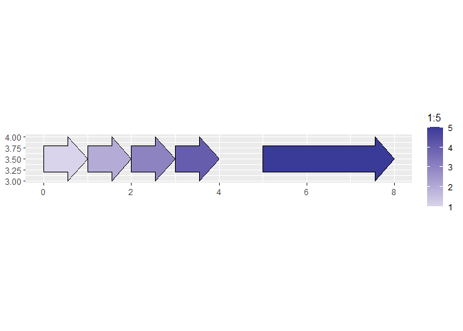

<!-- README.md is generated from README.Rmd. Please edit that file -->

# ggppt

<!-- badges: start -->
<!-- badges: end -->

A `ggplot2` extension which has geoms for common shapes and elements in
PowerPoint

## Installation

You can install the development version of ggppt from
[GitHub](https://github.com/) with:

``` r
devtools::install_github("doehm/ggppt")
```

## geoms

A list of geoms currently included:

- `geom_arrow`
- `geom_callout`
- `geom_chevron`
- `geom_cross`
- `geom_diamond`
- `geom_elbow`
- `geom_parallelogram`
- `geom_pentagon`
- `geom_triangle`

## Example

This is a basic example which shows you how to solve a common problem:

``` r
library(ggppt)
#> Loading required package: dplyr
#> 
#> Attaching package: 'dplyr'
#> The following objects are masked from 'package:stats':
#> 
#>     filter, lag
#> The following objects are masked from 'package:base':
#> 
#>     intersect, setdiff, setequal, union
#> Loading required package: purrr
suppressMessages(library(tidyverse))

df <- tibble(
  xmin = c(0:3, 5),
  xmax = c(1:4, 8),
  ymin = 3,
  ymax = 4
)

df |>
  ggplot(aes(xmin = xmin, xmax = xmax, ymin = ymin, ymax = ymax, fill = 1:5)) +
  geom_arrow(head_length = 0.15) +
  scale_fill_gradient2() +
  coord_fixed()
```


